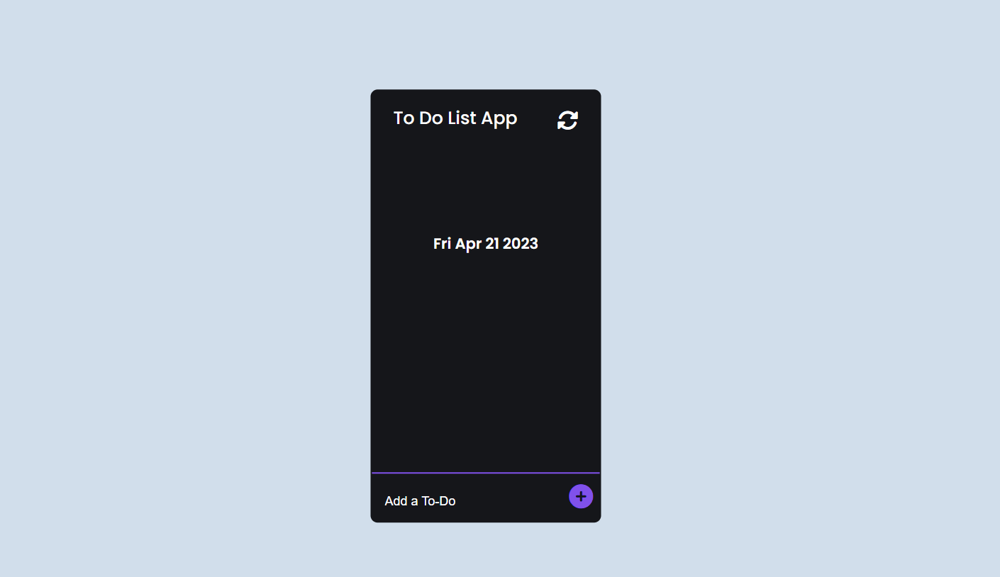

<h1>
 To-Do List &#9745;
</h1>

Bu To-Do List uygulaması, kullanıcıların hızlı ve kolay bir şekilde yapılacak işlerini kaydedip, listelerini yönetmelerine olanak tanıyan bir web uygulamasıdır. Kullanıcılar, yeni planlar ekleyebilir, listedeki planları işaretleyerek tamamlanmış olarak işaretleyebilir, silme işlemi yapabilir ve tüm listeyi sıfırlayabilirler. CSS ve Javascript kullanılarak oluşturulan bu program, minimalist ve kullanımı kolay bir arayüz sunar.  
------------------------
 
This To-Do List app is a web application that allows users to quickly and easily save their to-do tasks and manage their lists. Users can add new plans, mark items in the list as completed, delete tasks, and reset the entire list. This program is built using CSS and Javascript, and it offers a minimalist and user-friendly interface.

<h1>Used Technologies </h1>
<ul>

<h1>
 Preview 🎥
</h1>

